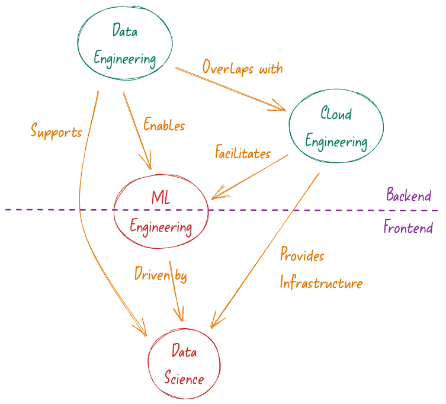

# The modern AI Fullstack engineer

The common understanding of a full stack engineer is of someone with a broad knowledge in technology, skilled in all areas of web development. This includes being good at both front-end and back-end technologies, and the knack for combining these separate parts into working applications. Full stack engineers have the know-how to design, build, and sometimes oversee web projects. In organizations, they often hold Senior or Technical Lead positions, working closely with both the front-end and back-end teams.

I like to think that a similar situation exists in departments that are heavily working with data and analytics. These departments are typically consisted of two types of teams, the first is responsible of data and cloud engineering providing the basis for onboarding and storing data in a scalable manner, while the second is responsible for machine learning and data science, tasked with extracting valuable insights from the data. In this context, the first team, along with a portion of the machine learning engineering role, acts similarly to a traditional back-end team, while the data science function mirrors the role of a front-end team.

